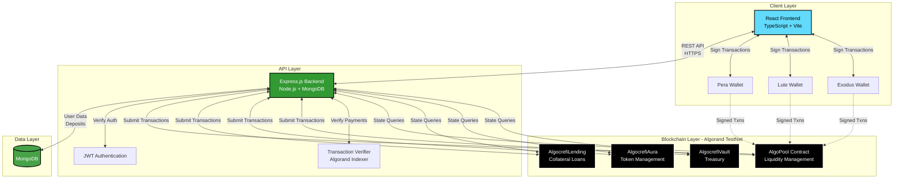

# AlgoCrefi

[](https://www.algorand.com/)
[](https://react.dev/)
[](https://nodejs.org/)
[](https://www.typescriptlang.org/)
[](https://github.com/donendosted/AlgoCrefi)

> A decentralized finance (DeFi) lending platform built on the Algorand blockchain, enabling collateralized and non-collateralized (Aura-based) lending with share-based liquidity pools.

## Overview

**AlgoCrefi** is a comprehensive DeFi ecosystem that demonstrates the convergence of traditional web2 authentication mechanisms with web3 blockchain operations. Built on the Algorand blockchain, AlgoCrefi provides a sophisticated lending infrastructure that supports two distinct loan models:

1. **Collateral-based Lending**: Traditional cryptocurrency lending requiring collateral deposits
2. **Aura-based Lending**: Innovative non-collateralized loans utilizing an Aura credit token system

The platform integrates a share-based liquidity pool mechanism, enabling users to contribute capital and earn proportional returns while maintaining custody of their assets through wallet-signed transactions. The system architecture prioritizes security, transparency, and user sovereignty through smart contract automation and cryptographic verification.

### Key Capabilities

- **Multi-Wallet Authentication**: Seamless integration with Pera, Lute, and Exodus wallets
- **Liquidity Pool Operations**: Deposit ALGO tokens and receive proportional shares
- **Dual Lending Models**: Support for both collateralized and credit-based borrowing
- **Real-time Analytics**: Live pool monitoring with historical data visualization
- **Smart Contract Automation**: Trustless execution via ARC-4 compliant Algorand contracts
- **Hybrid Transaction Model**: Balance between user custody and system automation

## Architecture

The AlgoCrefi system employs a three-tier architecture consisting of a React-based frontend, Node.js backend API, and four Algorand smart contracts governing the DeFi operations.



### Architectural Principles

- **Separation of Concerns**: Clear boundaries between presentation (React), business logic (Express), and state management (Smart Contracts)
- **Security-First Design**: User-signed transactions for deposits/withdrawals, backend-signed for loan operations
- **Atomic Operations**: Utilizes Algorand's AtomicTransactionComposer for multi-step transaction safety
- **Event-Driven Updates**: Real-time pool analytics through polling with 5-second intervals
- **Stateless API**: JWT-based authentication enabling horizontal scalability

## Technology Stack

### Frontend Technologies
| Technology | Version | Purpose |
|------------|---------|---------|
| **React** | 19.2.4 | Component-based UI framework |
| **React Router** | 7.13.2 | Full-stack routing with SSR support |
| **TypeScript** | 5.9.3 | Type-safe development |
| **Vite** | 7.1.7 | Build tool and development server |
| **Algorand SDK** | 3.5.2 | Blockchain interaction library |
| **Tailwind CSS** | 4.2.2 | Utility-first styling framework |
| **GSAP** | 3.13.0 | Animation library |
| **Three.js** | 0.167.1 | 3D graphics and shader effects |
| **Recharts** | 3.8.1 | Data visualization |

**Wallet Integrations**:
- Pera Wallet Connect 1.5.2
- Lute Connect 1.7.0
- Exodus (planned)

### Backend Technologies
| Technology | Version | Purpose |
|------------|---------|---------|
| **Node.js** | 20+ | JavaScript runtime environment |
| **Express.js** | 5.2.1 | Web application framework |
| **MongoDB** | - | NoSQL database for user data |
| **Mongoose** | 9.3.3 | MongoDB object modeling |
| **Algorand SDK** | 3.5.2 | Blockchain transaction handling |
| **JWT** | 9.0.3 | Stateless authentication |
| **bcryptjs** | 3.0.3 | Password hashing |

### Smart Contract Platform
| Technology | Version | Purpose |
|------------|---------|---------|
| **Algorand Python** | PuyaPy 5.7.1 | Smart contract development language |
| **AlgoKit** | 2.0.0+ | Development and deployment toolchain |
| **TEAL** | - | Algorand's native contract language |
| **ARC Standards** | ARC-4, ARC-22, ARC-28 | Contract specifications |

### Infrastructure & DevOps
- **Docker**: Multi-stage containerization
- **Git**: Version control
- **Algorand TestNet**: ChainID 416002
- **Render**: Backend hosting
- **AlgoNode API**: Blockchain node access

## Repository Structure

```
AlgoCrefi/
├── algoCrefi_Backend/          # Node.js Express API
│   ├── src/
│   │   ├── configs/            # Database and Algorand client setup
│   │   ├── models/             # MongoDB schemas (User, Deposit)
│   │   ├── routes/             # API route definitions
│   │   ├── controllers/        # Request handlers
│   │   ├── services/           # Business logic and blockchain interactions
│   │   ├── middlewares/        # JWT authentication
│   │   └── utils/              # Helper functions
│   ├── app.js                  # Express application configuration
│   ├── index.js                # Server entry point
│   └── package.json            # Backend dependencies
│
├── algoCrefi_Frontend/         # React TypeScript SPA
│   ├── app/
│   │   ├── components/         # Reusable UI components
│   │   │   ├── ui/            # Shadcn UI primitives
│   │   │   ├── Chart.tsx      # Pool analytics visualization
│   │   │   ├── Dither.tsx     # 3D shader background effects
│   │   │   ├── DotGrid.tsx    # Interactive particle animations
│   │   │   └── *Dialog.tsx    # Modal components
│   │   ├── pages/             # Page components
│   │   │   ├── home/          # Landing and authentication
│   │   │   ├── dashboard/     # User dashboard with pool stats
│   │   │   └── pool/          # Investment and borrowing interface
│   │   ├── utils/             # Service layer
│   │   │   ├── walletService.ts    # Wallet connection logic
│   │   │   └── poolService.ts      # Contract interaction helpers
│   │   └── routes.ts          # Route configuration
│   ├── Dockerfile             # Multi-stage production build
│   ├── vite.config.ts         # Build configuration
│   └── package.json           # Frontend dependencies
│
├── algocrefi-contract/         # Algorand Smart Contracts
│   └── projects/algocrefi-contract/
│       ├── smart_contracts/
│       │   ├── algocrefi_pool/        # Liquidity pool contract
│       │   ├── algocrefi_lending/     # Collateral lending contract
│       │   ├── algocrefi_aura/        # Token management contract
│       │   ├── algocrefi_vault/       # Treasury management contract
│       │   └── artifacts/             # Compiled TEAL and clients
│       ├── pyproject.toml             # Python dependencies
│       └── .algokit.toml              # AlgoKit configuration
│
├── .gitignore                  # Git exclusions
└── README.md                   # This file
```

### Component Responsibilities

- **Backend**: Authentication, transaction verification, database management, API gateway
- **Frontend**: User interface, wallet integration, transaction signing, real-time updates
- **Smart Contracts**: State management, transaction execution, trustless computation
- **Database**: User credentials, deposit history, session management

## Smart Contracts

AlgoCrefi deploys four ARC-4 compliant smart contracts on the Algorand blockchain, each serving a distinct function in the DeFi ecosystem. All contracts are written in Algorand Python (PuyaPy) and compiled to TEAL.

### 1. AlgoPool (Liquidity Pool Contract)

**Purpose**: Manages a share-based liquidity pool where users deposit ALGO tokens and receive proportional shares representing their ownership.

**State Schema**:
- Global State: `pool` (uint64), `total_shares` (uint64)
- Local State: `shares` (uint64) per user

**Core Methods**:

| Method | Parameters | Returns | Description |
|--------|-----------|---------|-------------|
| `opt_in()` | None | void | Initializes user's local state, required before deposits |
| `deposit(amount)` | uint64 | uint64 | Deposits ALGO and mints shares using pool ratio |
| `withdraw(share_amount)` | uint64 | uint64 | Burns shares and returns proportional ALGO via inner transaction |
| `get_pool()` | None | uint64 | Returns current pool balance (read-only) |
| `get_total_shares()` | None | uint64 | Returns total outstanding shares (read-only) |

**Share Calculation Algorithm**:
```
First Deposit: shares = amount (1:1 ratio)
Subsequent:    shares = (amount × total_shares) ÷ pool
Withdrawal:    algo = (share_amount × pool) ÷ total_shares
```

**Security Features**:
- Validates amount > 0
- Validates sufficient user shares for withdrawal
- Follows checks-effects-interactions pattern
- Prevents division by zero

**Deployed App ID**: `758287713` (TestNet)

---

### 2. AlgocrefiLending (Collateralized Lending Contract)

**Purpose**: Facilitates simple collateralized loans with 100% minimum collateralization ratio.

**State Schema**:
- Global State: `loan` (uint64), `collateral` (uint64)

**Core Methods**:

| Method | Parameters | Returns | Description |
|--------|-----------|---------|-------------|
| `borrow(amount, collateral_amount)` | uint64, uint64 | void | Creates loan if collateral ≥ amount |
| `repay(amount)` | uint64 | void | Repays loan and releases collateral |
| `get_loan()` | None | uint64 | Returns outstanding loan amount |

**Collateralization Rules**:
- Minimum collateral: 100% of loan amount
- No interest calculation (simplified model)
- Full repayment required to release collateral

---

### 3. AlgocrefiAura (Token Management Contract)

**Purpose**: Manages the supply of Aura tokens used in the non-collateralized lending system.

**State Schema**:
- Global State: `total_supply` (uint64)

**Core Methods**:

| Method | Parameters | Returns | Description |
|--------|-----------|---------|-------------|
| `mint(amount)` | uint64 | void | Increases total supply by amount |
| `burn(amount)` | uint64 | void | Decreases total supply (validates sufficient supply) |
| `get_total_supply()` | None | uint64 | Returns current total supply |

**Use Case**: Represents credit-based borrowing capacity in the Aura lending model.

---

### 4. AlgocrefiVault (Treasury Contract)

**Purpose**: Basic vault for centralized balance tracking and treasury management.

**State Schema**:
- Global State: `total_balance` (uint64)

**Core Methods**:

| Method | Parameters | Returns | Description |
|--------|-----------|---------|-------------|
| `deposit(amount)` | uint64 | void | Increments total balance |
| `withdraw(amount)` | uint64 | void | Decrements balance (validates sufficiency) |
| `get_total_balance()` | None | uint64 | Returns current balance |

---

### Contract Standards Compliance

All contracts adhere to:
- **ARC-4**: Application Binary Interface specification for typed method calls
- **ARC-22**: Read-only method specification for gas-free queries
- **ARC-28**: Event logging standard (where applicable)

### Deployment Process

Contracts are deployed using AlgoKit with the following workflow:

1. **Compilation**: Python → TEAL + ARC56 specification
2. **Client Generation**: Auto-generated typed Python clients
3. **Network Selection**: LocalNet, TestNet, or MainNet
4. **Deployment Strategy**: 
   - `OnUpdate.AppendApp`: Creates new app on update
   - `OnSchemaBreak.AppendApp`: Creates new app on schema change
5. **Verification**: App ID logged and stored in environment variables

**Build Command**: `algokit project run build`  
**Deploy Command**: `algokit project deploy testnet`

## Setup Instructions

### Prerequisites

Ensure the following software is installed on your system:

- **Node.js** 20.x or higher ([Download](https://nodejs.org/))
- **Python** 3.12+ ([Download](https://www.python.org/))
- **AlgoKit CLI** 2.0.0+ ([Installation Guide](https://github.com/algorandfoundation/algokit-cli))
- **MongoDB** Community Edition ([Download](https://www.mongodb.com/try/download/community))
- **Git** ([Download](https://git-scm.com/))
- **Docker** (optional, for containerized deployment)

### Clone Repository

```bash
git clone https://github.com/donendosted/AlgoCrefi.git
cd AlgoCrefi
```

---

### Backend Setup

#### 1. Navigate to Backend Directory

```bash
cd algoCrefi_Backend
```

#### 2. Install Dependencies

```bash
npm install
```

#### 3. Configure Environment Variables

Create a `.env` file in the `algoCrefi_Backend/` directory:

```env
# Server Configuration
PORT=5000

# MongoDB
MONGO_URI=mongodb://localhost:27017/algocrefi

# JWT Authentication
JWT_SECRET=your_jwt_secret_key_here
JWT_EXPIRES=7d

# Algorand Configuration
MNEMONIC=your 25 word algorand mnemonic phrase here
ALGOD_TOKEN=
ALGOD_SERVER=https://testnet-api.algonode.cloud
ALGOD_PORT=443

# Smart Contract App IDs
POOL_APP_ID=758287713
LENDING_APP_ID=your_lending_app_id
AURA_APP_ID=your_aura_app_id
```

**Note**: Replace placeholder values with your actual credentials. Never commit `.env` files to version control.

#### 4. Start MongoDB

Ensure MongoDB is running on your system:

```bash
# macOS (Homebrew)
brew services start mongodb-community

# Linux (systemd)
sudo systemctl start mongod

# Windows
net start MongoDB
```

#### 5. Start Backend Server

```bash
npm start
```

The backend API will be available at `http://localhost:5000`.

**API Health Check**: `GET http://localhost:5000/api/pool/pool-info`

---

### Frontend Setup

#### 1. Navigate to Frontend Directory

```bash
cd ../algoCrefi_Frontend
```

#### 2. Install Dependencies

```bash
npm install
```

#### 3. Configure Environment (Optional)

The frontend uses the backend API at `https://algocrefi-backend.onrender.com` by default. To use your local backend, update API calls in:

- `app/utils/poolService.ts`
- `app/utils/walletService.ts`
- `app/pages/dashboard/dashboard.tsx`

Replace `https://algocrefi-backend.onrender.com` with `http://localhost:5000`.

#### 4. Start Development Server

```bash
npm run dev
```

The frontend will be available at `http://localhost:5173`.

#### 5. Build for Production (Optional)

```bash
npm run build
npm run start
```

Production build will run on `http://localhost:3000`.

---

### Smart Contract Setup

#### 1. Navigate to Contract Directory

```bash
cd ../algocrefi-contract/projects/algocrefi-contract
```

#### 2. Install Python Dependencies

```bash
# Install Poetry (if not already installed)
curl -sSL https://install.python-poetry.org | python3 -

# Install dependencies
poetry install
```

#### 3. Build Contracts

```bash
algokit project run build
```

This compiles all contracts to TEAL and generates ARC56 specifications in `smart_contracts/artifacts/`.

#### 4. Configure Deployment

Create environment files for each network:

**`.env.testnet`**:
```env
DEPLOYER=your 25 word mnemonic phrase for deployer account
```

**`.env.localnet`** (for local testing):
```env
# AlgoKit LocalNet uses default accounts
```

#### 5. Deploy Contracts

**To TestNet**:
```bash
algokit project deploy testnet
```

**To LocalNet** (for testing):
```bash
algokit localnet start
algokit project deploy localnet
```

**Deploy Specific Contract**:
```bash
algokit project deploy testnet -- algocrefi_pool
```

#### 6. Update Backend Configuration

After deployment, copy the App IDs from the deployment logs and update your backend `.env` file:

```env
POOL_APP_ID=<deployed_pool_app_id>
LENDING_APP_ID=<deployed_lending_app_id>
AURA_APP_ID=<deployed_aura_app_id>
```

---

### Verification

To verify the complete system is running:

1. **Backend**: `curl http://localhost:5000/api/pool/pool-info`
2. **Frontend**: Open browser to `http://localhost:5173`
3. **Smart Contracts**: Use AlgoKit to query contract state:
   ```bash
   algokit goal app info --app-id <POOL_APP_ID>
   ```

### Docker Deployment (Optional)

**Frontend**:
```bash
cd algoCrefi_Frontend
docker build -t algocrefi-frontend .
docker run -p 3000:3000 algocrefi-frontend
```

**Backend**:
```bash
cd algoCrefi_Backend
docker build -t algocrefi-backend .
docker run -p 5000:5000 --env-file .env algocrefi-backend
```

## Project Status

**Current Phase**: Alpha Development

This project is in active development and should be considered experimental. The following components are functional:

✅ **Implemented**:
- Multi-wallet authentication (Pera, Lute)
- Liquidity pool deposits and withdrawals
- Smart contract interactions
- Real-time pool analytics
- JWT-based API authentication
- Share-based accounting system

⚠️ **In Progress**:
- Collateralized lending implementation
- Aura token minting and burning
- Interest calculation mechanisms
- Comprehensive error handling
- Production deployment configurations

🔮 **Planned**:
- Exodus wallet integration
- Advanced analytics dashboard
- Governance token implementation
- Mainnet deployment
- Comprehensive test coverage
- Security audits

**Security Notice**: This software has not undergone professional security audits. Do not use with significant funds or in production environments without thorough testing and auditing.

## License

This project is licensed under the **MIT License**.

```
MIT License

Copyright (c) 2026 AlgoCrefi Contributors

Permission is hereby granted, free of charge, to any person obtaining a copy
of this software and associated documentation files (the "Software"), to deal
in the Software without restriction, including without limitation the rights
to use, copy, modify, merge, publish, distribute, sublicense, and/or sell
copies of the Software, and to permit persons to whom the Software is
furnished to do so, subject to the following conditions:

The above copyright notice and this permission notice shall be included in all
copies or substantial portions of the Software.

THE SOFTWARE IS PROVIDED "AS IS", WITHOUT WARRANTY OF ANY KIND, EXPRESS OR
IMPLIED, INCLUDING BUT NOT LIMITED TO THE WARRANTIES OF MERCHANTABILITY,
FITNESS FOR A PARTICULAR PURPOSE AND NONINFRINGEMENT. IN NO EVENT SHALL THE
AUTHORS OR COPYRIGHT HOLDERS BE LIABLE FOR ANY CLAIM, DAMAGES OR OTHER
LIABILITY, WHETHER IN AN ACTION OF CONTRACT, TORT OR OTHERWISE, ARISING FROM,
OUT OF OR IN CONNECTION WITH THE SOFTWARE OR THE USE OR OTHER DEALINGS IN THE
SOFTWARE.
```

---

## Acknowledgments

- **Algorand Foundation** for the blockchain infrastructure
- **AlgoKit Team** for development tooling
- **Pera Wallet** and **Lute Wallet** for wallet integrations
- Open source community for supporting libraries

## Contact & Resources

- **Repository**: [https://github.com/donendosted/AlgoCrefi](https://github.com/donendosted/AlgoCrefi)
- **Algorand Developer Portal**: [https://developer.algorand.org](https://developer.algorand.org)
- **AlgoKit Documentation**: [https://github.com/algorandfoundation/algokit-cli](https://github.com/algorandfoundation/algokit-cli)

---

**Built with ❤️ on Algorand by team RupanDos**
